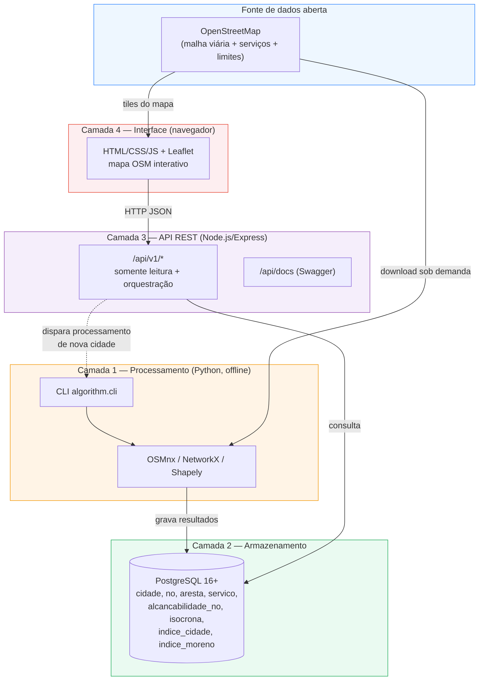
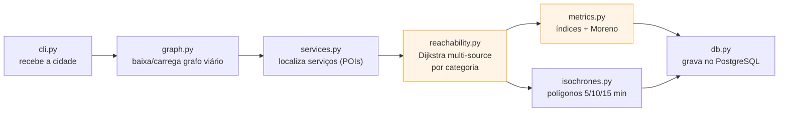
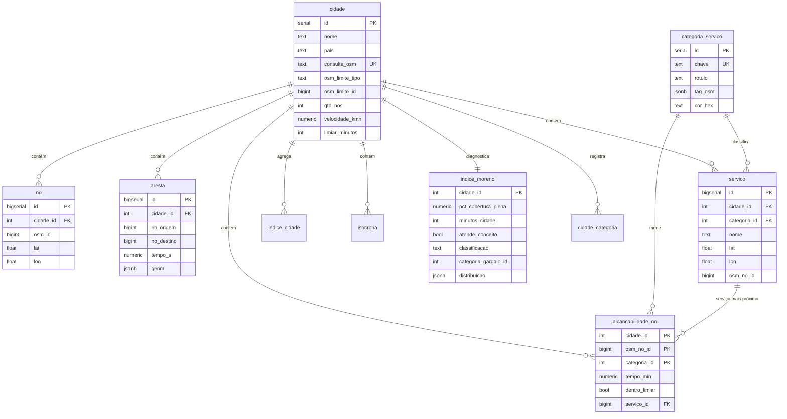
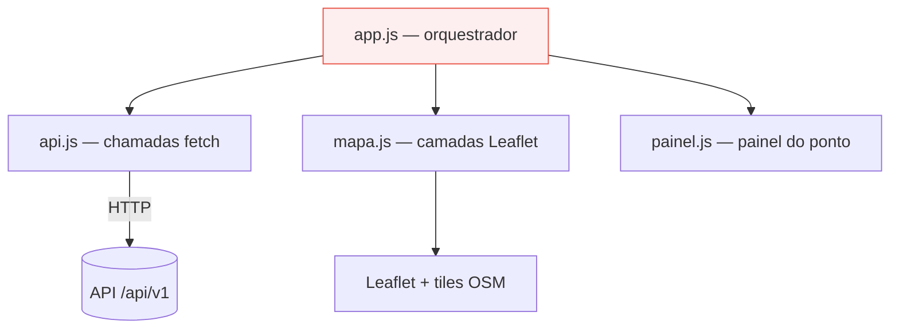
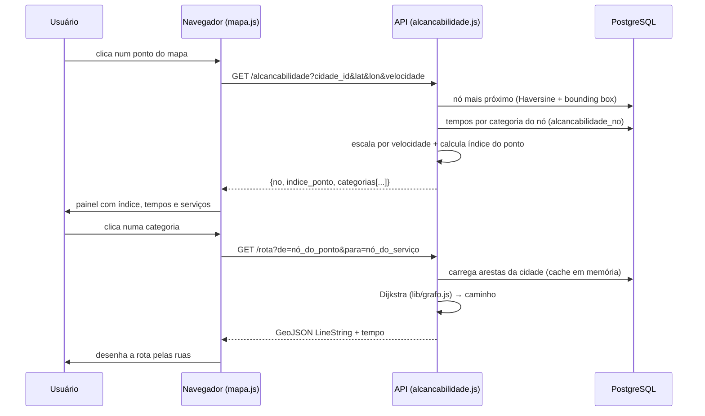
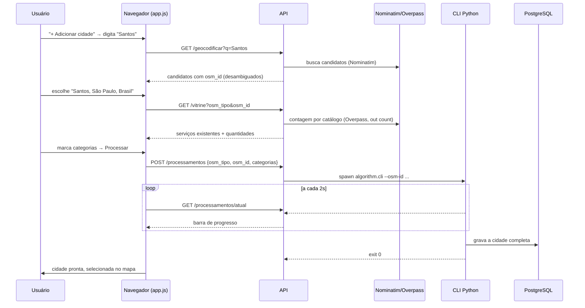

# Documentação Técnica — Plataforma de Alcançabilidade Urbana (Cidade de 15 Minutos)

> Documento de referência técnica do sistema. Descreve a arquitetura, cada
> módulo de código, o algoritmo, os conceitos matemáticos, o modelo de dados,
> a API e a interface. Acompanha o [Relatório do Projeto](RELATORIO.md), que
> apresenta a mesma solução em linguagem acessível a leigos.
>
> Projeto de Conclusão de Curso — Ciência da Computação — UNIP (2026).
> Autores: Bruno Nascimento de Paula Silva, Guilherme Silva Pereira da Rocha,
> Pedro Henrique de Jesus. Orientador: Prof. Dr. José de França Bueno.

---

## Sumário

1. [Visão geral](#1-visão-geral)
2. [Arquitetura de alto nível](#2-arquitetura-de-alto-nível)
3. [Esqueleto do projeto (mapa de arquivos)](#3-esqueleto-do-projeto-mapa-de-arquivos)
4. [Camada 1 — Algoritmo (Python)](#4-camada-1--algoritmo-python)
5. [Camada 2 — Banco de dados (PostgreSQL)](#5-camada-2--banco-de-dados-postgresql)
6. [Camada 3 — API REST (Node.js/Express)](#6-camada-3--api-rest-nodejsexpress)
7. [Camada 4 — Interface web (Leaflet)](#7-camada-4--interface-web-leaflet)
8. [Catálogo mestre e a "vitrine" de serviços](#8-catálogo-mestre-e-a-vitrine-de-serviços)
9. [Fluxos completos (diagramas de sequência)](#9-fluxos-completos-diagramas-de-sequência)
10. [Conceitos matemáticos](#10-conceitos-matemáticos)
11. [Como executar](#11-como-executar)
12. [Testes automatizados](#12-testes-automatizados)
13. [Decisões de projeto e limitações](#13-decisões-de-projeto-e-limitações)
14. [Glossário](#14-glossário)

> Os diagramas usam a sintaxe **Mermaid**, renderizada automaticamente pelo
> GitHub, GitLab, VS Code (extensão Markdown Preview Mermaid) e pela maioria
> dos visualizadores de Markdown. Em um editor sem suporte, os blocos
> aparecem como texto — o conteúdo continua legível.

---

## 1. Visão geral

A plataforma mede, de forma automatizada e verificável, **quão perto os
serviços essenciais de uma cidade estão dos seus habitantes, a pé**, tomando
como referência o conceito urbanístico da **Cidade de 15 Minutos** (Carlos
Moreno, 2016). O sistema responde a duas perguntas complementares:

- **Ponto a ponto**: "a partir DESTE endereço, quanto tempo eu levo a pé até
  cada tipo de serviço?" (índice do ponto, de 0 a 100).
- **Cidade inteira**: "esta cidade, como um todo, atende ao conceito de 15
  minutos?" (o **Diagnóstico de Moreno** — a cidade é classificada como
  "cidade de N minutos").

Toda a informação geográfica vem do **OpenStreetMap (OSM)**, base de dados
livre e colaborativa, sob licença ODbL. Nenhuma fonte proprietária é usada.

**Números de referência** (metodologia atual, caminhada a 3 km/h, 12
categorias de serviço):

| Cidade | Índice geral (0–100) | Minutos da cidade (P90) | Cobertura plena | Gargalo |
|---|---|---|---|---|
| Paris (FR) | 75,35 | 69 | 2,34 % | Rodoviárias |
| Águas de São Pedro (SP) | 33,36 | 35 | 12,30 % | Escolas |
| Praia Grande (SP) | 29,07 | 179 | 0,22 % | Rodoviárias |
| Guarujá (SP) | 27,95 | 161 | 0,00 % | Creches |

---

## 2. Arquitetura de alto nível

O sistema é dividido em quatro camadas independentes, com contratos bem
definidos entre elas (o schema do banco e o `openapi.yaml`). A camada de
processamento (Python) é *offline* (roda sob demanda para preparar uma
cidade); as demais servem o uso interativo.



**Princípio-chave**: o cálculo pesado (caminhos mínimos sobre milhares de
nós) é feito **uma vez** por cidade, no Python, e persistido. A API e a
interface nunca recalculam esse trabalho — apenas consultam o banco e fazem
agregações leves. É isso que permite respostas instantâneas no navegador.

### Stack tecnológica

| Camada | Tecnologias | Papel |
|---|---|---|
| Processamento | Python 3.11, OSMnx ≥ 2.0, NetworkX, Shapely ≥ 2.0, GeoPandas, psycopg2 | Baixar OSM, construir grafo, calcular alcançabilidade e isócronas, gravar no banco |
| Armazenamento | PostgreSQL 16+ (sem PostGIS) | Persistir cidades, nós, arestas, serviços, métricas, isócronas |
| API | Node.js 20+, Express 4, `pg`, Swagger UI, helmet, cors, express-rate-limit | Servir dados, orquestrar processamento sob demanda, geocodificar |
| Interface | HTML/CSS/JS puro, Leaflet 1.9, tiles do OSM | Mapa interativo, painéis, isócronas, mapa de calor |
| Testes | pytest (Python), Vitest + Supertest (Node) | 5 testes de pipeline + 24 de API |

---

## 3. Esqueleto do projeto (mapa de arquivos)

```
PROJETO_15MIN/
│
├── algorithm/                    ← CAMADA 1: processamento (Python)
│   ├── config.py           (15)  Configuração (dataclass): velocidade, limiar, cache
│   ├── graph.py            (51)  Baixa/carrega o grafo viário do OSM; calcula travel_time
│   ├── services.py         (80)  Localiza os serviços (POIs) por categoria
│   ├── reachability.py     (43)  ★ Dijkstra multi-source + Voronoi (núcleo do cálculo)
│   ├── metrics.py         (218)  ★ Índices, agregados e Diagnóstico de Moreno (a matemática)
│   ├── isochrones.py       (58)  Gera polígonos de isócrona (concave_hull)
│   ├── db.py              (228)  Persiste tudo no PostgreSQL numa transação
│   ├── cli.py            (201)  Orquestra o pipeline; interface de linha de comando
│   └── tests/test_pipeline.py (159)  Testes do pipeline
│
├── db/                           ← CAMADA 2: definição do banco
│   ├── schema.sql         (106)  Contrato nº 1: todas as tabelas
│   ├── seed.sql            (18)  As 13 categorias de serviço (0=sentinela + 12 reais)
│   └── catalogo_mestre.json (72) 70 tags OSM curadas (a "vitrine")
│
├── api/                          ← CAMADA 3: API REST (Node.js)
│   ├── openapi.yaml      (1039)  Contrato nº 2: documentação OpenAPI/Swagger
│   ├── src/
│   │   ├── server.js       (11)  Sobe o servidor
│   │   ├── app.js         (186)  Monta o Express: middlewares, rotas, /comparar, /saude
│   │   ├── db.js           (15)  Pool de conexão PostgreSQL
│   │   ├── lib/grafo.js   (126)  ★ Dijkstra em JS (rotas e cobertura pessoal) + cache
│   │   └── routes/
│   │       ├── cidades.js       (691)  Detalhe, serviços, mapa, /moreno dinâmico, excluir, reprocessar
│   │       ├── alcancabilidade.js (136)  Análise de um ponto clicado
│   │       ├── rota.js           (59)  Caminho a pé entre dois nós
│   │       ├── isocronas.js      (58)  Serve as isócronas (GeoJSON)
│   │       ├── geocodificar.js  (104)  Busca canônica de cidades (Nominatim)
│   │       ├── vitrine.js       (111)  Contagem de serviços por catálogo (Overpass)
│   │       └── processamentos.js (265)  Dispara e monitora o CLI Python
│   ├── scripts/
│   │   ├── alter_db.js     (38)  Migração: colunas osm_limite_*
│   │   └── backfill_osm_id.js (72)  Preenche identidade canônica das cidades antigas
│   └── tests/api.test.js  (210)  24 testes de integração
│
├── web/                          ← CAMADA 4: interface (navegador)
│   ├── index.html        (237)  Página principal (mapa)
│   ├── comparar.html     (169)  Comparação entre cidades
│   ├── sobre.html        (148)  O conceito, a equipe, licenças
│   ├── api.html          (566)  Documentação amigável da API pública
│   ├── css/estilo.css    (611)  Estilo unificado
│   └── js/
│       ├── config.js       (2)  URL base da API
│       ├── api.js         (91)  Funções de fetch (uma por endpoint)
│       ├── mapa.js       (323)  Leaflet: cliques, rotas, isócronas, mapa de calor, pins
│       ├── painel.js     (122)  Painel de resultados do ponto
│       ├── app.js        (976)  Orquestrador: seletor, modais, diagnóstico, gestão
│       └── comparar.js   (227)  Lógica da comparação
│
├── PLANO/                        ← 15 arquivos .md: o plano executável fase a fase
├── docker/docker-compose.yml     ← Deploy (banco + API em containers)
├── DOCS/                         ← Esta documentação e o relatório
└── README.md
```

★ = arquivos que concentram a lógica central. Total: **~10.000 linhas** de
código-fonte (fora dependências e o plano).

---

## 4. Camada 1 — Algoritmo (Python)

O pacote `algorithm/` transforma o nome de uma cidade num conjunto completo
de métricas de alcançabilidade gravadas no banco. É executado pela linha de
comando (ou disparado pela API). O fluxo interno:



### 4.1 `config.py` — parâmetros do processamento

Uma `dataclass` `Configuracao` reúne todos os parâmetros:

| Campo | Padrão | Significado |
|---|---|---|
| `consulta_osm` | — | Texto livre da cidade (modo legado) |
| `osm_tipo` / `osm_id` | — | Identidade canônica do limite (`relation`/`way` + id) |
| `velocidade_kmh` | **3.0** | Velocidade de caminhada. 3 km/h é conservadora — acomoda idosos e mobilidade reduzida (justificada no TCC, seção 1.2.4) |
| `limiar_minutos` | **15** | O "15" da Cidade de 15 Minutos |
| `minutos_isocronas` | `(5, 10, 15)` | Cortes de tempo para os polígonos |
| `usar_cache_grafo` / `atualizar` | `True`/`False` | Controlam se o grafo é rebaixado do OSM |

### 4.2 `graph.py` — a malha viária como grafo

Baixa a rede de ruas caminháveis (`network_type="walk"`) do OSM via OSMnx e a
representa como um **grafo direcionado** (`MultiDiGraph` do NetworkX):

- **Nós** = interseções e pontos da malha (cada um com latitude/longitude).
- **Arestas** = trechos de rua entre interseções (cada uma com `length` em
  metros e a geometria real do traçado).

O peso de tempo de cada aresta é calculado explicitamente, com velocidade
uniforme:

```python
velocidade_ms = velocidade_kmh * 1000 / 3600   # km/h → m/s
travel_time   = length / velocidade_ms         # segundos
```

O grafo é salvo em disco (`cache_osm/<slug>.graphml`) — a segunda execução da
mesma cidade dispensa o download (segundos em vez de minutos). Com
`--atualizar`, o cache é ignorado e os dados são rebaixados do OSM.

A função `slug()` normaliza o nome (remove acentos e pontuação) para nomear o
arquivo de cache; quando a identidade canônica existe, o slug é
`<osm_tipo>_<osm_id>` (ex.: `relation_298463`).

### 4.3 `services.py` — onde estão os serviços

Para cada categoria (hospital, escola, mercado...), consulta o OSM pelos
estabelecimentos correspondentes (`features_from_place`/`features_from_polygon`):

- Serviços com área (polígonos, ex.: uma escola) têm sua geometria reduzida
  ao **centroide**.
- Cada serviço é ancorado ao **nó do grafo mais próximo**
  (`ox.distance.nearest_nodes`, em lote — muito mais rápido que um a um).
- Serviços sem nome **não** são descartados (a versão original descartava,
  subestimando a oferta).

Retorna, por categoria, a lista de serviços com `(nome, lat, lon, nó do grafo)`.

### 4.4 `reachability.py` — o núcleo do cálculo ★

Este é o coração do sistema, e onde está a principal otimização do projeto.

**O problema**: para cada nó da cidade, quanto tempo se leva a pé até o
serviço *mais próximo* de cada categoria?

**A abordagem ingênua** (versão original do TCC) rodava um Dijkstra a partir
de *cada serviço* — centenas de execuções por cidade (≈1 hora em Paris).

**A abordagem atual** roda **um único Dijkstra multi-source por categoria**:
partindo simultaneamente de *todos* os serviços daquela categoria, o
algoritmo encontra, em uma só varredura, o tempo do serviço mais próximo para
todos os nós:

```python
tempos_s = nx.multi_source_dijkstra_path_length(
    G, sources=list(nos_servicos), weight="travel_time"
)
tempos = {no: t / 60 for no, t in tempos_s.items()}   # segundos → minutos
```

Para saber **qual** serviço é o mais próximo de cada nó (usado para desenhar
a rota e marcar o serviço no mapa), usa-se o particionamento de **Voronoi
sobre o grafo**:

```python
celulas = nx.voronoi_cells(G, center_nodes=set(nos_servicos), weight="travel_time")
```

Cada "célula" agrupa os nós atendidos por um mesmo serviço. Nós desconectados
caem em `unreachable` (tempo nulo → inalcançável).

**Nota metodológica** (documentada no código): o grafo é direcionado, e o
multi-source calcula distâncias no sentido *serviço → nó*. Como a rede de
pedestres é bidirecional (`walk`), assume-se tempo(serviço→nó) ≈
tempo(nó→serviço).

**Ganho de complexidade**: de O(S · (E + V log V)) para O(C · (E + V log V)),
onde S = número de serviços (centenas), C = número de categorias (≈12),
V = nós, E = arestas. Na prática, um *speedup* de ~44× (Praia Grande: ~3 min
→ 4,1 s em cache).

### 4.5 `metrics.py` — índices e Diagnóstico de Moreno ★

Concentra toda a matemática de agregação. Três funções:

**`indice_no(tempos_por_categoria, limiar)`** — índice de um ponto (0–100):

```
índice_do_nó = (nº de categorias alcançáveis em ≤ 15 min) / (nº de categorias com serviço) × 100
```

**`agregados_cidade(...)`** — métricas por categoria e o índice geral:
- Por categoria: tempo médio (média dos nós alcançáveis), `pct_dentro_limiar`
  (% de nós com tempo ≤ limiar), `indice` (= `pct_dentro_limiar`).
- Índice geral (categoria sentinela 0): tempo médio = média das médias;
  `indice` = média dos índices individuais de todos os nós.

**`diagnostico_moreno(...)`** — a métrica da cidade inteira (ver a
[seção 10](#10-conceitos-matemáticos) para a formalização). Em resumo:
1. Para cada nó, calcula o **pior tempo** entre todas as categorias
   presentes: `tempo_pior(v) = max_c tempo(v, c)`. Se alguma categoria é
   inalcançável do nó, `tempo_pior(v) = None` (sem cobertura plena).
2. **Cobertura plena** = % de nós com `tempo_pior ≤ 15`.
3. **Minutos da cidade** = P90 (percentil 90) dos `tempo_pior`, arredondado
   para cima.
4. **Gargalo** = categoria com o menor `pct_dentro_limiar`.
5. **Classificação**: ≤15 "Cidade de 15 Minutos"; ≤20 "Muito próxima"; ≤30
   "Parcialmente aderente"; acima "Distante do conceito".
6. **Histograma** de `tempo_pior` em faixas fixas (0-5, 5-10, ..., 30+, sem
   cobertura).

### 4.6 `isochrones.py` — as manchas de alcance

Uma isócrona é a área alcançável a partir dos serviços de uma categoria
dentro de um tempo. Para cada (categoria, corte ∈ {5,10,15}):
1. Coleta os nós com `tempo ≤ corte`.
2. Constrói um `MultiPoint` (shapely) com suas coordenadas.
3. Gera o polígono com `shapely.concave_hull(pontos, ratio=0.4)` — um
   contorno que "abraça" os pontos de forma mais realista que o fecho convexo;
   com *fallback* para `convex_hull` quando há poucos pontos ou erro.
4. Converte para GeoJSON (`shapely.geometry.mapping`).

### 4.7 `db.py` — persistência transacional

Grava tudo em **uma única transação** (`with conn:`), de forma idempotente:
se a cidade já existe (por identidade canônica ou `consulta_osm`), ela é
apagada primeiro (o `ON DELETE CASCADE` limpa todas as tabelas filhas) e
recriada. As inserções em massa usam `execute_values` (páginas de 10.000
linhas). Grava, em ordem: `cidade` → `no` → `aresta` → `servico` →
`alcancabilidade_no` → `indice_cidade` → `isocrona` → `indice_moreno` →
`cidade_categoria`.

### 4.8 `cli.py` — orquestração

Junta tudo e expõe a linha de comando:

```
python -m algorithm.cli --place "Praia Grande, São Paulo, Brazil"
                        [--osm-tipo relation --osm-id 298316 --nome "..."]
                        [--velocidade 3.0] [--limiar 15] [--sem-cache] [--atualizar]
```

Emite marcadores de progresso legíveis por máquina para a API acompanhar:
```
##PROGRESSO## {"pct": 45, "etapa": "servicos_ok", "msg": "..."}
```
A saída humana evita emojis (o console do Windows usa cp1252). Códigos de
saída: 0 sucesso; 2 cidade inexistente no OSM; 1 outros erros.

---

## 5. Camada 2 — Banco de dados (PostgreSQL)

Sem PostGIS: coordenadas são `double precision`, geometrias (isócronas,
traçados de rua) são **GeoJSON em `jsonb`**. Decisão consciente — nada no
escopo exige operações espaciais no servidor, e evita a instalação frágil do
PostGIS no Windows.



### Tabelas em detalhe

| Tabela | Papel | Cardinalidade típica |
|---|---|---|
| `cidade` | Metadados de cada cidade processada (nome, país, identidade OSM canônica, velocidade, limiar) | dezenas |
| `categoria_servico` | Catálogo das categorias (id 0 = sentinela do índice geral; 1–12 reais) | 13 |
| `no` | Cada nó do grafo viário, com lat/lon; índice em `(cidade_id, lat, lon)` para busca do nó mais próximo | milhares por cidade |
| `aresta` | Trechos de rua com tempo e traçado GeoJSON — alimenta o Dijkstra em JS da API | ~3× os nós |
| `servico` | Estabelecimentos localizados, ancorados a um nó | centenas por cidade |
| `alcancabilidade_no` | **Tabela central**: por (nó, categoria), o tempo ao serviço mais próximo, se está no limiar e qual serviço | nós × categorias (dezenas de milhares) |
| `indice_cidade` | Agregados por categoria + linha geral (categoria 0) | 13 por cidade |
| `isocrona` | Polígonos GeoJSON por (categoria, minutos) | ~36 por cidade |
| `indice_moreno` | O diagnóstico da cidade inteira (1 linha) | 1 por cidade |
| `cidade_categoria` | Quais categorias foram processadas para a cidade (base da "vitrine" seletiva) | até 12 por cidade |

**Identidade canônica** (evita cidades duplicadas): `(osm_limite_tipo,
osm_limite_id)` tem índice único. "Guarujá, Brasil" e "Guarujá, Brazil"
resolvem para o mesmo `relation 298463` e, portanto, para a mesma cidade.

---

## 6. Camada 3 — API REST (Node.js/Express)

Base: `http://localhost:3000/api/v1`. Respostas em JSON; erros sempre no
formato `{ "erro": "...", "codigo": 4xx }`. Documentação interativa em
`/api/docs` (Swagger, gerado do `openapi.yaml`).

Middlewares (em `app.js`): `helmet` (cabeçalhos de segurança), `cors`
(leitura aberta), `morgan` (log), `express-rate-limit` (100 req / 15 min por
IP — o polling de processamento é isento), `express.static` (serve a pasta
`web/`).

### 6.1 Endpoints de leitura

| Método | Rota | Descrição |
|---|---|---|
| GET | `/saude` | Health check (`{status, banco}`) |
| GET | `/cidades` | Lista as cidades processadas (com índice geral) |
| GET | `/cidades/:id` | Detalhe + índices por categoria + objeto `moreno` (diagnóstico oficial gravado) |
| GET | `/cidades/:id/servicos?categoria=` | Serviços em GeoJSON (FeatureCollection) |
| GET | `/cidades/:id/isocronas?categoria=&minutos=` | Isócrona (GeoJSON) |
| GET | `/cidades/:id/mapa?categoria=&max=&velocidade=` | Amostra de nós para o mapa de calor (`categoria=plena` = cobertura plena) |
| GET | `/alcancabilidade?cidade_id=&lat=&lon=&velocidade=` | **Análise de um ponto**: nó mais próximo, índice, tempos por categoria e serviço mais próximo |
| GET | `/rota?cidade_id=&de=&para=&velocidade=` | Caminho a pé entre dois nós (GeoJSON LineString + tempo) |
| GET | `/comparar?cidades=1,2,3` | Compara até 5 cidades (índices + moreno) |
| GET | `/cidades/:id/moreno?categorias=&velocidade=&trabalho_no=` | **Diagnóstico dinâmico** (recalculado na hora — ver 6.3) |

### 6.2 Endpoints de escrita/orquestração

| Método | Rota | Descrição |
|---|---|---|
| GET | `/geocodificar?q=` | Busca canônica no Nominatim; retorna candidatos com `osm_id` e se já processados |
| GET | `/vitrine?osm_tipo=&osm_id=` | Conta serviços do catálogo existentes na cidade (Overpass) antes de processar |
| POST | `/processamentos` | Dispara o CLI Python para uma nova cidade (identidade canônica + categorias escolhidas) |
| GET | `/processamentos/atual` | Estado do processamento em andamento (polling da barra de progresso) |
| DELETE | `/cidades/:id` | Exclui a cidade (CASCADE) |
| POST | `/cidades/:id/reprocessar` | Rebaixa e reprocessa a cidade (`--atualizar`) |

### 6.3 O endpoint dinâmico `/cidades/:id/moreno` ★

É a peça que dá interatividade ao diagnóstico. Recalcula o Diagnóstico de
Moreno **sem reprocessar a cidade**, a partir de três parâmetros:

- **`categorias`** (CSV de chaves): escolhe quais serviços entram na conta.
  Como `alcancabilidade_no` já tem o tempo de cada nó a cada categoria,
  reagrupar é uma consulta SQL (`GROUP BY osm_no_id` com `max(tempo_min)`
  filtrado pelas categorias). Não há Dijkstra novo.
- **`velocidade`** (2,0–6,0 km/h): como a velocidade é uniforme, todos os
  tempos escalam por um fator exato `fator = velocidade_base / velocidade`.
  Um tempo de 20 min a 3 km/h vira 15 min a 4 km/h (20 × 3/4).
- **`trabalho_no`** (osm_id): inclui o local de trabalho como destino
  adicional (o pilar "trabalho" de Moreno). Aqui sim roda um Dijkstra —
  mas **em Node**, sobre o grafo em memória (`dijkstraCompleto` de
  `lib/grafo.js`), a partir do nó do trabalho. Combina:
  `tempo_pior = max(tempo_pior_serviços, tempo_até_trabalho) × fator`.

O P90, a mediana, a cobertura, o gargalo e o histograma são recomputados em
JavaScript sobre esses tempos. O diagnóstico **oficial** gravado em
`indice_moreno` nunca é alterado — o dinâmico é uma "vista" configurável.

### 6.4 `lib/grafo.js` — Dijkstra em JavaScript

Reimplementa o essencial do NetworkX no Node para os cálculos interativos:
- `carregarGrafo(cidadeId)` — monta a lista de adjacência a partir da tabela
  `aresta`, com cache em memória (TTL 10 min).
- `MinHeap` — fila de prioridade (heap binário) para o Dijkstra.
- `dijkstra(adj, origem, destino)` — caminho mínimo com parada antecipada
  (usado por `/rota`).
- `dijkstraCompleto(adj, origem)` — distâncias da origem a *todos* os nós
  (usado pelo modo trabalho do `/moreno`).
- `montarGeometria(adj, caminho)` — concatena os traçados reais das arestas
  do caminho em uma LineString GeoJSON.

---

## 7. Camada 4 — Interface web (Leaflet)

HTML/CSS/JS puro (sem framework, sem etapa de build), consumindo a API. O
mapa usa **Leaflet 1.9** com os *tiles* padrão do OpenStreetMap (atribuição
ODbL obrigatória e presente).



**Páginas**: `index.html` (mapa principal), `comparar.html` (comparação de
cidades), `sobre.html` (conceito, equipe, licenças), `api.html`
(documentação amigável da API pública, com exemplos em cURL/JavaScript/Python).

**Funcionalidades do mapa** (`mapa.js` + `app.js`):
- **Clique em qualquer ponto** → chama `/alcancabilidade` → painel com índice
  do ponto (0–100), tempos por categoria, serviço mais próximo.
- **Rota real** ao clicar numa categoria → `/rota` → linha que segue as ruas
  (contorno branco + cor da categoria), com pontilhado curto ligando o clique
  ao nó da malha.
- **Isócronas** ligáveis por categoria e corte de tempo.
- **Mapa de calor** dos nós por categoria (ou cobertura plena), com escala de
  cores por faixa de tempo.
- **Cartão de Diagnóstico de Moreno** ao selecionar a cidade, com
  "Personalizar análise" (categorias + velocidade), "Cobertura por serviço"
  clicável e o modal "Como calculamos?".
- **Pins de casa 🏠 e trabalho 💼** (arrastáveis, salvos por cidade no
  `localStorage`) — o modo completo (6 pilares) recalcula o diagnóstico
  incluindo o trabalho.
- **Adicionar cidade** (modal com busca canônica + vitrine + barra de
  progresso) e **Gerenciar cidades** (excluir/reprocessar).

---

## 8. Catálogo mestre e a "vitrine" de serviços

O `db/catalogo_mestre.json` é uma curadoria de **70 tags do OSM** já
traduzidas, agrupadas e com cores definidas — a solução para o caos das tags
voluntárias do OSM (evita expor lixo como "lixeiras" ou termos não
traduzidos, e resolve a exigência de cor por categoria).

Cada item tem a forma:
```json
{ "chave": "hospital", "rotulo": "Hospitais", "grupo": "Saúde",
  "tag": {"amenity": "hospital"}, "cor": "#e74c3c", "padrao": true }
```

**Fluxo da vitrine** (antes de baixar a cidade inteira):
1. O usuário escolhe a cidade (via `/geocodificar`, identidade canônica).
2. `/vitrine` monta um script **Overpass** com `out count` para cada tag do
   catálogo e pergunta ao OSM **apenas as quantidades** — rápido, sem baixar
   geometrias.
3. A interface mostra só os itens do catálogo que **existem** naquela cidade,
   com a contagem ("Parques: 96", "Escolas: 2"...).
4. O usuário marca o que interessa; só então o processamento baixa e calcula
   **apenas o escolhido**.

É a metáfora da "vitrine": olhar o que a cidade tem e escolher, em vez de
baixar tudo às cegas.

---

## 9. Fluxos completos (diagramas de sequência)

### 9.1 Consultar a alcançabilidade de um ponto (clique no mapa)



### 9.2 Adicionar uma cidade nova (sob demanda)



---

## 10. Conceitos matemáticos

Notação: seja **G = (V, E)** o grafo viário da cidade (V = nós, E = arestas).
Cada aresta *(u,v)* tem comprimento *ℓ(u,v)* em metros. A velocidade de
caminhada *s* é uniforme (padrão 3 km/h). O limiar é *τ* = 15 min. **C** é o
conjunto de categorias de serviço presentes na cidade.

### 10.1 Peso temporal das arestas

$$ w(u,v) = \frac{\ell(u,v)}{s} \quad \text{(segundos, com } s \text{ em m/s)} $$

### 10.2 Caminho mínimo (Dijkstra)

O tempo de caminhada entre dois nós é o custo do caminho mais curto:

$$ d(a,b) = \min_{\text{caminho } a \to b} \sum_{(u,v) \in \text{caminho}} w(u,v) $$

O algoritmo de **Dijkstra** resolve isso em O(E + V log V) com fila de
prioridade. É exato para pesos não negativos (sempre o caso aqui).

### 10.3 Tempo ao serviço mais próximo (multi-source)

Para uma categoria *c* com serviços ancorados no conjunto de nós *S_c*, o
tempo do nó *v* ao serviço mais próximo é:

$$ t(v, c) = \min_{p \in S_c} d(p, v) $$

Calculado de uma vez para todos os *v* com **Dijkstra multi-source** (fonte
virtual conectada a todos os *p ∈ S_c* com custo 0). Se *v* é inalcançável de
*S_c*, então *t(v,c) = ∅* (nulo).

### 10.4 Índice de um ponto

$$ I(v) = \frac{|\{c \in C : t(v,c) \le \tau\}|}{|C|} \times 100 $$

Percentual das categorias que o ponto *v* alcança dentro do limiar. Varia de
0 (nenhuma) a 100 (todas).

### 10.5 Pior tempo por ponto (critério de Moreno)

O conceito de Moreno exige acesso a **todos** os pilares — logo, o que
importa é o pior caso, não a média:

$$
T_{\text{pior}}(v) =
\begin{cases}
\displaystyle\max_{c \in C} t(v,c) & \text{se } t(v,c) \neq \varnothing \; \forall c \in C \\[2mm]
\varnothing & \text{se algum } t(v,c) = \varnothing
\end{cases}
$$

Um ponto só "vive" a Cidade de 15 Minutos se *T_pior(v) ≤ τ* — ou seja, se
até o serviço mais demorado está a 15 min.

### 10.6 Métricas da cidade

Seja *V\** = { v ∈ V : T_pior(v) ≠ ∅ } o conjunto de nós com cobertura
completa possível.

**Cobertura plena** (fração do território que atende plenamente ao conceito):

$$ \text{CP} = \frac{|\{v \in V : T_{\text{pior}}(v) \le \tau\}|}{|V|} \times 100 $$

**Minutos da cidade** (o número-síntese, "cidade de N minutos"):

$$ N = \lceil P_{90}(\{T_{\text{pior}}(v) : v \in V^*\}) \rceil $$

onde *P₉₀* é o **percentil 90** da distribuição dos piores tempos. Usa-se
P90, e não o máximo, para que um único ponto isolado (um sítio na divisa) não
determine sozinho a nota da cidade; e não a média, que esconderia o gargalo.
No código, o percentil é obtido por ordenação e indexação:
`índice = ⌊0,9 × (n − 1)⌋` (Python) / interpolação linear entre vizinhos (JS).

**Veredito**: a cidade *atende ao conceito* se *N ≤ τ*.

**Classificação**:

$$
\text{classe}(N) =
\begin{cases}
\text{Cidade de 15 Minutos} & N \le 15 \\
\text{Muito próxima} & 15 < N \le 20 \\
\text{Parcialmente aderente} & 20 < N \le 30 \\
\text{Distante do conceito} & N > 30
\end{cases}
$$

### 10.7 Gargalo

A categoria que mais impede a cidade de ser 15 minutos é a de menor cobertura
individual:

$$ \text{gargalo} = \arg\min_{c \in C} \; \frac{|\{v : t(v,c) \le \tau\}|}{|V|} $$

### 10.8 Escala de velocidade (por que não reprocessar)

Como *w(u,v) = ℓ(u,v)/s* com *s* uniforme, mudar a velocidade de *s₀* para
*s₁* multiplica **todos** os tempos por um fator constante:

$$ t_{s_1}(v,c) = t_{s_0}(v,c) \cdot \frac{s_0}{s_1} $$

Logo, o sistema recalcula o diagnóstico para qualquer velocidade escalando os
tempos já gravados — sem novo Dijkstra. (As isócronas, polígonos fixos a 3
km/h, são a única exceção: ficam desabilitadas fora da velocidade padrão.)

### 10.9 Modo completo — trabalho como destino (6 pilares)

Com um local de trabalho no nó *p_trab*, o pior tempo de cada ponto passa a
considerar também o deslocamento casa→trabalho:

$$ T_{\text{pior}}^{+}(v) = \max\Big( T_{\text{pior}}(v),\; d(p_{\text{trab}}, v) \Big) \cdot \frac{s_0}{s_1} $$

Como se adiciona um destino ao *max*, vale *T⁺_pior(v) ≥ T_pior(v)* — o
número da cidade no modo completo é sempre **maior ou igual** ao do modo
livre (adicionar uma exigência nunca melhora o pior caso). Essa monotonicidade
é verificada nos testes.

### 10.10 Voronoi sobre grafo (serviço mais próximo)

O particionamento de Voronoi atribui cada nó *v* ao serviço *p* que minimiza
*d(p,v)*:

$$ \text{dono}(v) = \arg\min_{p \in S_c} d(p, v) $$

Usado para desenhar a rota e destacar o serviço no mapa. É calculado junto
com o multi-source, sem custo adicional relevante.

---

## 11. Como executar

Pré-requisitos: Python 3.11 (com o `venv` do projeto), Node.js 20+,
PostgreSQL 16+ rodando com o banco `alcancabilidade` (schema + seed
aplicados). Detalhes completos em [`PLANO/01_AMBIENTE.md`](../PLANO/01_AMBIENTE.md).

```powershell
# 1) Processar uma cidade (uma vez por cidade)
$env:PYTHONIOENCODING = "utf-8"
cd C:\Users\User\Downloads\TCC\PROJETO_15MIN
.venv\Scripts\python.exe -m algorithm.cli --place "Praia Grande, São Paulo, Brazil"

# 2) Subir a API (serve também a interface)
cd api
npm run dev            # http://localhost:3000

# 3) Abrir no navegador
#    Interface:      http://localhost:3000
#    Documentação:   http://localhost:3000/api/docs
#    API amigável:   http://localhost:3000/api.html
```

Após a primeira execução, novas cidades podem ser adicionadas pela própria
interface ("+ Adicionar nova cidade..."), sem linha de comando.

---

## 12. Testes automatizados

| Suíte | Comando | Cobertura |
|---|---|---|
| Pipeline Python | `python -m pytest algorithm\tests -v` | slug, índice do ponto, grafo/pesos, pipeline completo (grava e confere no banco), diagnóstico de Moreno |
| API Node | `cd api; npm test` (Vitest + Supertest) | 24 testes: saúde, cidades, alcançabilidade, rota, moreno dinâmico (com/sem trabalho), geocodificar, vitrine, mapa `plena`, validações 400/404 |

Estado atual: **5 pytest + 24 vitest, todos verdes**. Os testes de
geocodificação e vitrine exigem rede (Nominatim/Overpass).

---

## 13. Decisões de projeto e limitações

**Decisões deliberadas**:
- PostgreSQL **sem PostGIS** — nada no escopo exige geometria server-side.
- Cálculo pesado **offline** e persistido; API/interface só agregam.
- Dijkstra **reimplementado em JS** na API para rotas e cobertura pessoal —
  evita chamar Python no caminho interativo.
- Identidade **canônica por osm_id** — elimina cidades duplicadas por grafia.

**Limitações conhecidas** (registradas para o TCC):
- A qualidade depende do OSM: cidades mal mapeadas subestimam a oferta. Uma
  categoria sem nenhum serviço no OSM é excluída do cálculo (e sinalizada),
  para não penalizar por falha de mapeamento e não por desenho urbano.
- Só **caminhada** (sem transporte público/bicicleta) — arquitetura pronta
  para multimodal (GTFS) no futuro.
- O pilar **trabalho** de Moreno não é mensurável por POIs; é suprido pelo
  modo completo (marcador do usuário). O pilar **moradia** é a origem das
  medições.
- Índice por **presença e proximidade**, sem ponderar qualidade/capacidade
  dos serviços.

---

## 14. Glossário

| Termo | Significado |
|---|---|
| **Nó** | Ponto da malha de ruas (interseção ou vértice), com latitude/longitude |
| **Aresta** | Trecho de rua entre dois nós, com comprimento e tempo de travessia |
| **Grafo** | A malha de ruas modelada como nós + arestas |
| **Dijkstra** | Algoritmo clássico que encontra o caminho mais rápido num grafo |
| **Multi-source** | Dijkstra partindo de vários pontos ao mesmo tempo (todos os serviços de uma categoria) |
| **Voronoi (em grafo)** | Partição dos nós por "serviço dono" mais próximo |
| **Isócrona** | Área alcançável a partir de um ponto/serviço dentro de um tempo |
| **POI** | *Point of Interest* — um serviço mapeado no OSM (escola, hospital...) |
| **Índice do ponto** | 0–100: % de categorias que aquele ponto alcança em 15 min |
| **Tempo pior** | Para um ponto, o maior tempo entre todas as categorias (o gargalo local) |
| **Cobertura plena** | % do território que alcança TODOS os serviços em 15 min |
| **Minutos da cidade** | P90 dos "tempos piores" — o número-síntese "cidade de N minutos" |
| **Gargalo** | A categoria de menor cobertura, que puxa o número da cidade para cima |
| **P90 (percentil 90)** | Valor que 90% dos dados não ultrapassam |
| **OSM / Nominatim / Overpass** | Base de dados livre / seu geocodificador / sua API de consulta |
| **ODbL** | Licença dos dados do OSM (exige atribuição) |
| **GeoJSON** | Formato-padrão para geometrias (pontos, linhas, polígonos) |

---

*Documentação gerada a partir da leitura direta do código-fonte
(commit da fase 14 auditada). Para o passo a passo de implementação de cada
funcionalidade, ver a pasta [`PLANO/`](../PLANO/).*
