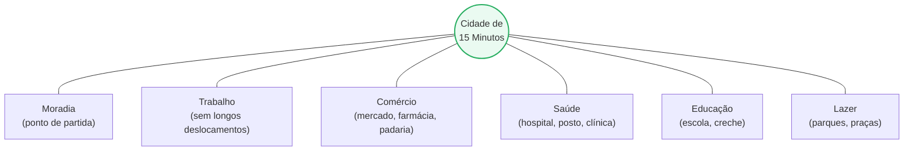
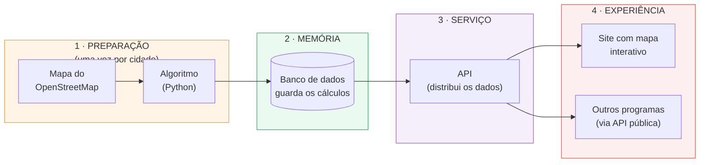
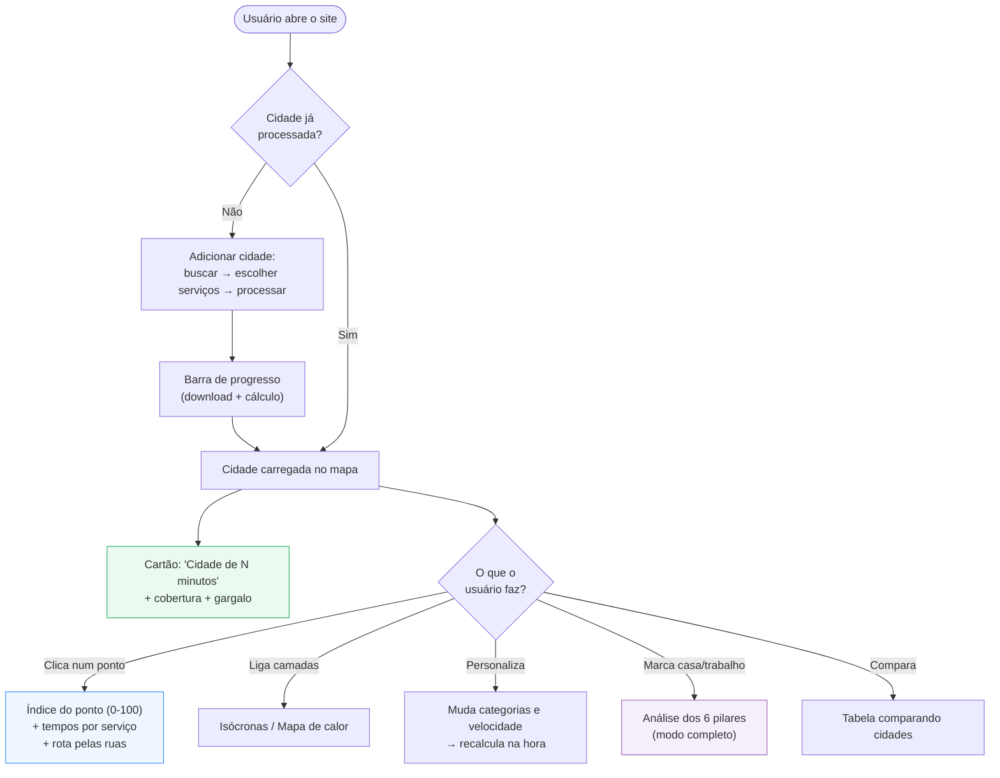
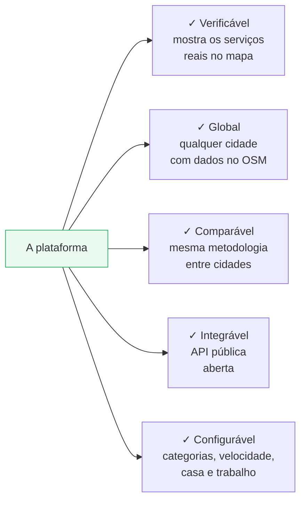

# Relatório do Projeto — Mensuração Computacional de Alcançabilidade Urbana
## Cidade de 15 Minutos

> Relatório apresentado em duas camadas de leitura: as seções de **visão
> geral** e **como funciona** são escritas para qualquer leitor; as seções de
> **conceitos matemáticos** e **arquitetura** aprofundam para o leitor
> técnico. Acompanha a [Documentação Técnica](DOCUMENTACAO.md).
>
> Projeto de Conclusão de Curso — Ciência da Computação — UNIP (2026).
> Bruno Nascimento de Paula Silva · Guilherme Silva Pereira da Rocha · Pedro
> Henrique de Jesus. Orientador: Prof. Dr. José de França Bueno.

---

## Sumário

1. [Resumo para todos os públicos](#1-resumo-para-todos-os-públicos)
2. [O problema](#2-o-problema)
3. [O conceito: a Cidade de 15 Minutos](#3-o-conceito-a-cidade-de-15-minutos)
4. [Mapa do projeto](#4-mapa-do-projeto)
5. [Fluxograma geral](#5-fluxograma-geral)
6. [Como cada peça funciona (para leigos)](#6-como-cada-peça-funciona-para-leigos)
7. [Conceitos matemáticos (para técnicos)](#7-conceitos-matemáticos-para-técnicos)
8. [Resultados obtidos](#8-resultados-obtidos)
9. [O que torna este projeto diferente](#9-o-que-torna-este-projeto-diferente)
10. [Limitações e trabalhos futuros](#10-limitações-e-trabalhos-futuros)
11. [Ficha técnica](#11-ficha-técnica)

---

## 1. Resumo para todos os públicos

Imagine poder olhar para um mapa de qualquer cidade do mundo e responder, com
números, a uma pergunta simples mas difícil: **"as pessoas que moram aqui
conseguem chegar a pé, em até 15 minutos, a tudo que precisam no dia a dia —
escola, mercado, farmácia, hospital, parque?"**

Este projeto construiu um sistema que responde exatamente isso. Ele:

- pega o mapa livre e colaborativo do **OpenStreetMap**;
- transforma as ruas da cidade em uma "rede" que o computador entende;
- calcula, para **cada esquina** da cidade, quanto tempo se leva a pé até
  cada tipo de serviço;
- resume tudo em um veredito claro: *"Guarujá é uma cidade de 161 minutos"* —
  e mostra no mapa onde estão as regiões bem e mal servidas.

O usuário pode **clicar em qualquer ponto** e ver sua situação pessoal, ou
olhar a **cidade inteira**. Pode **adicionar qualquer cidade** (o sistema
baixa e processa na hora), **comparar cidades** entre si, e até marcar **onde
mora e onde trabalha** para uma análise sob medida. Tudo isso numa página web
com um mapa interativo, e com uma **API pública** para que outros
programadores usem esses dados em seus próprios projetos.

---

## 2. O problema

O planeta está cada vez mais urbano — cerca de 58 % das pessoas já vivem em
cidades, rumo a 67 % até 2050. Quanto mais as cidades crescem, mais urgente
fica uma pergunta antiga do urbanismo: **as pessoas têm acesso justo aos
serviços essenciais?**

Medir esse acesso é surpreendentemente difícil. As abordagens tradicionais
tropeçam em três limitações:

1. **Imprecisão** — usam a distância em linha reta ("distância euclidiana"),
   que ignora que ninguém anda atravessando quarteirões, rios e muros. A
   distância real, pelas ruas, é sempre maior e varia muito.
2. **Falta de verificação** — muitas ferramentas mostram um número, mas não
   deixam ver *quais* serviços foram considerados. Não dá para confiar nem
   auditar.
3. **Falta de integração** — os resultados ficam presos numa tela, sem forma
   de alimentar outros sistemas (planejamento de transporte, estudos, etc.).

O sistema deste projeto ataca as três: mede pela **rua real**, **mostra os
serviços no mapa** e oferece uma **API aberta**.

---

## 3. O conceito: a Cidade de 15 Minutos

Proposto pelo urbanista franco-colombiano **Carlos Moreno em 2016**, o
conceito da Cidade de 15 Minutos diz que todo habitante deveria alcançar, a
pé ou de bicicleta, em no máximo 15 minutos, **seis pilares** da vida
cotidiana:

A ideia ganhou o mundo depois da pandemia de 2020 (quando a mobilidade
reduzida expôs as desigualdades de acesso) e virou política pública em Paris,
Barcelona, Melbourne e outras.

**A grande dificuldade** é que "15 minutos" é uma *meta a ser medida*, não uma
realidade dada. É aí que entra a computação: traduzir esse critério em algo
calculável sobre as ruas reais de qualquer cidade. Este projeto faz essa
tradução.

> **Nota honesta sobre os pilares**: dos seis pilares, quatro
> (comércio, saúde, educação, lazer) existem como pontos no mapa do OSM e são
> medidos automaticamente. **Trabalho** e **moradia** dependem de cada pessoa
> — por isso o sistema permite marcá-los manualmente (o "modo completo"). No
> modo padrão, a moradia é representada por *cada ponto do território* (é de
> onde se mede).

---

## 4. Mapa do projeto

O sistema tem quatro grandes partes, como uma linha de montagem que vai do
dado bruto até a tela do usuário:

**Em palavras**: a parte 1 (Python) faz o trabalho pesado — baixa o mapa,
calcula os tempos — e guarda tudo na parte 2 (banco de dados). A parte 3 (API)
serve esses dados sob demanda. A parte 4 (site) mostra tudo num mapa bonito e
interativo, e a mesma API pode alimentar programas de terceiros.

A vantagem desse desenho: **o cálculo demorado acontece só uma vez**. Quando
você clica no mapa, a resposta é instantânea, porque tudo já foi calculado e
guardado.

---

## 5. Fluxograma geral

O caminho completo de uma pergunta, do clique à resposta:

---

## 6. Como cada peça funciona (para leigos)

### 6.1 De mapa a "rede de ruas"

O computador não entende "ruas" como nós; ele entende **pontos e ligações**.
Então a primeira coisa que o sistema faz é transformar o mapa numa **rede**
(o que os matemáticos chamam de *grafo*):

- cada **esquina** vira um **ponto**;
- cada **trecho de rua** entre duas esquinas vira uma **ligação**, com uma
  "etiqueta" dizendo quanto tempo se leva para caminhá-lo.

Como sabemos o tempo de cada trecho? Simples: o comprimento da rua dividido
pela velocidade de caminhada (o sistema usa **3 km/h** por padrão — um ritmo
propositalmente devagar, que inclui idosos e pessoas com mobilidade reduzida).

### 6.2 Encontrar o caminho mais rápido

Com a rede pronta, o sistema usa um método clássico da computação — o
**algoritmo de Dijkstra** — que encontra o **caminho mais rápido** entre
pontos, como faz o GPS do celular. A diferença é que aqui ele calcula de uma
vez o tempo de *todas* as esquinas até o serviço mais próximo de cada tipo.

Uma otimização importante do projeto: em vez de calcular a partir de cada
hospital, cada escola, cada mercado separadamente (o que levava ~1 hora numa
cidade grande), o sistema calcula **por tipo de serviço de uma vez só** —
reduzindo o tempo para poucos segundos (ganho de cerca de **44 vezes**).

### 6.3 Do ponto à cidade inteira

Aqui está a ideia central, e vale a pena entender bem — foi a pergunta que
originou boa parte do desenvolvimento.

Para **cada esquina**, o sistema anota o tempo até cada tipo de serviço e
guarda o **pior** deles — o serviço mais demorado de alcançar dali. Por quê o
pior? Porque Moreno exige acesso a **tudo**: não adianta ter farmácia a 1
minuto se a escola está a 40. A esquina só "vive" a Cidade de 15 Minutos se
até o seu pior serviço está a 15 minutos.

Depois, o sistema ordena todas as esquinas e pega o valor que cobre **90 %**
delas. Esse é o número da cidade. Quando o sistema diz *"Guarujá é uma cidade
de 161 minutos"*, significa: **em 90 % do território do Guarujá, alcançar
todos os serviços essenciais a pé leva até 161 minutos**.

Por que 90 % e não 100 %? Para que um único sítio isolado na divisa do
município não estrague a nota da cidade inteira. E por que o "pior" e não a
média? Porque a média esconderia justamente o problema — o serviço que falta.

### 6.4 Por que os números às vezes assustam (e por que isso é honesto)

O número do Guarujá (161 minutos) parece altíssimo — e está *certo*. O
"culpado" é um tipo de serviço específico: o **terminal rodoviário**, que
costuma ser **um só** para a cidade inteira. Como quase ninguém mora a 15
minutos a pé da rodoviária, ela entra no "pior tempo" de quase todo ponto e
puxa o número lá para cima.

O sistema **não esconde isso** — mostra que o "gargalo" é a rodoviária e
permite ao usuário **desmarcá-la** e recalcular na hora. Ao remover
rodoviária e creches, o Guarujá cai para 123 minutos; considerando só os
pilares essenciais de bairro, cai para 97. Essa transparência é uma virtude:
a ferramenta revela *onde* está o problema, em vez de mascará-lo numa média.

### 6.5 As camadas visuais

- **Isócronas** são "manchas" no mapa mostrando até onde se chega em 5, 10 ou
  15 minutos a partir dos serviços de um tipo.
- O **mapa de calor** pinta cada esquina de verde (perto) a vermelho (longe),
  dando uma visão imediata das regiões bem e mal servidas.
- A **rota** desenhada ao clicar segue as ruas de verdade, curva por curva —
  não um risco reto no mapa.

---

## 7. Conceitos matemáticos (para técnicos)

Esta seção formaliza o que a seção anterior descreveu. Notação: **G = (V, E)**
é o grafo viário (V nós, E arestas); *ℓ(u,v)* é o comprimento da aresta em
metros; *s* é a velocidade de caminhada (m/s); *τ = 15* min é o limiar; **C**
é o conjunto de categorias presentes.

**Peso temporal das arestas** — cada trecho recebe o tempo de travessia:

$$ w(u,v) = \frac{\ell(u,v)}{s} $$

**Caminho mínimo** — tempo real de deslocamento pela malha (algoritmo de
Dijkstra, complexidade O(E + V log V)):

$$ d(a,b) = \min_{\text{caminho } a\to b} \sum_{(u,v)} w(u,v) $$

**Tempo ao serviço mais próximo** de uma categoria *c* (serviços em *S_c*),
resolvido com Dijkstra multi-source:

$$ t(v,c) = \min_{p \in S_c} d(p,v) $$

**Índice de um ponto** (0–100):

$$ I(v) = \frac{|\{c \in C : t(v,c) \le \tau\}|}{|C|}\times 100 $$

**Pior tempo por ponto** (o critério de Moreno — acesso a *todos* os pilares):

$$
T_{\text{pior}}(v) =
\begin{cases}
\max_{c \in C} t(v,c) & \text{se todos os } t(v,c) \text{ existem} \\
\varnothing & \text{caso contrário}
\end{cases}
$$

**Cobertura plena** (fração do território plenamente atendida):

$$ \mathrm{CP} = \frac{|\{v : T_{\text{pior}}(v) \le \tau\}|}{|V|}\times 100 $$

**Minutos da cidade** (número-síntese) — percentil 90 dos piores tempos:

$$ N = \big\lceil P_{90}\big(\{T_{\text{pior}}(v) \neq \varnothing\}\big) \big\rceil $$

O uso do percentil 90 (em vez do máximo) confere robustez a *outliers*
periféricos; o uso do máximo por ponto (em vez da média entre categorias)
preserva a exigência de Moreno de acesso simultâneo a todos os pilares.

**Classificação**:

$$
\text{classe}(N)=
\begin{cases}
\text{Cidade de 15 Minutos}, & N \le 15\\
\text{Muito próxima}, & 15 < N \le 20\\
\text{Parcialmente aderente}, & 20 < N \le 30\\
\text{Distante do conceito}, & N > 30
\end{cases}
$$

**Gargalo** — categoria de menor cobertura, responsável por elevar *N*:

$$ \text{gargalo}=\arg\min_{c\in C}\frac{|\{v:t(v,c)\le\tau\}|}{|V|} $$

**Invariância de escala à velocidade** — como *s* é uniforme, alterá-la de
*s₀* para *s₁* apenas reescala os tempos, dispensando novo cálculo:

$$ t_{s_1}(v,c) = t_{s_0}(v,c)\cdot \frac{s_0}{s_1} $$

**Modo completo (6 pilares)** — incluindo trabalho no nó *p_trab*:

$$ T^{+}_{\text{pior}}(v) = \max\!\big(T_{\text{pior}}(v),\, d(p_{\text{trab}}, v)\big)\cdot\frac{s_0}{s_1} \;\ge\; T_{\text{pior}}(v) $$

A desigualdade (adicionar um destino a um *max* nunca reduz o resultado)
garante que o número no modo completo é sempre ≥ o do modo livre —
monotonicidade verificada em teste automatizado.

> A derivação completa, com a correspondência entre cada fórmula e o
> arquivo/linha de código, está na [Documentação Técnica, seção 10](DOCUMENTACAO.md#10-conceitos-matemáticos).

---

## 8. Resultados obtidos

Quatro cidades foram processadas (caminhada a 3 km/h, 12 categorias de
serviço). Os resultados são coerentes com o perfil urbano conhecido de cada
uma:

| Cidade | Índice geral (0–100) | Tempo médio de acesso | "Cidade de N minutos" | Cobertura plena | Gargalo |
|---|---|---|---|---|---|
| **Paris** (FR) | 75,35 | 12,9 min | 69 min | 2,34 % | Rodoviárias |
| **Águas de São Pedro** (SP) | 33,36 | 15,8 min | 35 min | 12,30 % | Escolas |
| **Praia Grande** (SP) | 29,07 | 41,2 min | 179 min | 0,22 % | Rodoviárias |
| **Guarujá** (SP) | 27,95 | 45,0 min | 161 min | 0,00 % | Creches |

**Leitura dos resultados**:
- **Paris** — referência mundial na aplicação do conceito — lidera com folga
  (índice 75, tempo médio de 13 min), confirmando que o método reconhece uma
  cidade genuinamente compacta.
- As cidades litorâneas do estado de São Paulo (**Praia Grande, Guarujá**)
  aparecem distantes do conceito, coerente com sua geografia alongada e a
  concentração de serviços em poucos centros.
- **Águas de São Pedro**, o menor município do Brasil em área, tem a melhor
  cobertura plena entre as brasileiras — território compacto ajuda.

> **Validação metodológica**: o número dinâmico (recalculado pela API) bate
> exatamente com o gravado pelo algoritmo Python — duas implementações
> independentes (SQL/JavaScript e Python) chegam ao mesmo valor. E a escala de
> velocidade confere: Guarujá cai de 161 min (3 km/h) para 97 min a 5 km/h,
> pois 161 × 3/5 ≈ 97.

**Ganho de desempenho** (a otimização central do projeto):

| | Versão original | Versão atual |
|---|---|---|
| Praia Grande — tempo de cálculo | ~3 min | **4,1 s** (em cache) |
| Método | 1 Dijkstra por serviço (centenas) | 1 Dijkstra por categoria (≈12) |
| Ganho | — | **~44×** |

---

## 9. O que torna este projeto diferente

Comparado às ferramentas existentes, a combinação de características é inédita:

- **Verificabilidade** — os serviços considerados aparecem no mapa; qualquer
  um pode conferir. A maioria das ferramentas só mostra um número.
- **Cobertura global** — por usar exclusivamente o OSM, roda em qualquer
  cidade sem configuração manual.
- **Comparação padronizada** — cidades medidas pela mesma régua.
- **API aberta** — os dados podem ser consumidos por outros sistemas (com
  documentação amigável em `/api.html` e técnica em `/api/docs`).
- **Transparência configurável** — o usuário escolhe os serviços, a
  velocidade e pode incluir sua casa e trabalho, entendendo *como* o número
  se forma.

---

## 10. Limitações e trabalhos futuros

**Limitações** (assumidas com honestidade acadêmica):
- Os resultados dependem da qualidade do mapeamento no OSM, que varia entre
  regiões. Cidades pouco mapeadas subestimam a oferta. Categorias sem nenhum
  serviço no OSM são excluídas da conta (e sinalizadas), para não punir por
  falha de dado.
- Só considera **caminhada** — sem ônibus, metrô ou bicicleta ainda.
- Mede **presença e proximidade**, não a qualidade ou a capacidade dos
  serviços (uma escola lotada conta igual a uma vazia).
- Os pilares **trabalho** e **moradia** dependem do usuário (modo completo).

**Trabalhos futuros**:
- Transporte público (padrão GTFS) para alcançabilidade **multimodal** —
  caminhada + ônibus.
- Dados socioeconômicos (renda, densidade) para medir **equidade**: não só
  onde falta acesso, mas *quem* é mais afetado.
- Simulação em tempo real: inserir um serviço novo e ver o impacto na hora.
- Ponderação por qualidade/capacidade dos serviços.
- Séries históricas: acompanhar a evolução da alcançabilidade de uma cidade.

---

## 11. Ficha técnica

| Item | Detalhe |
|---|---|
| **Fonte de dados** | OpenStreetMap (malha viária, serviços, limites) — licença ODbL |
| **Processamento** | Python 3.11 · OSMnx · NetworkX · Shapely |
| **Banco de dados** | PostgreSQL 16+ (geometrias em GeoJSON/JSONB) |
| **API** | Node.js 20+ · Express · documentação Swagger |
| **Interface** | HTML/CSS/JavaScript · Leaflet · tiles do OSM |
| **Algoritmo central** | Dijkstra multi-source por categoria + Voronoi em grafo |
| **Métrica da cidade** | Percentil 90 do pior tempo por ponto |
| **Código-fonte** | ~10.000 linhas · 5 testes Python + 24 de API (todos verdes) |
| **Cidades validadas** | Paris, Praia Grande, Guarujá, Águas de São Pedro |

---

*Para a descrição técnica completa (cada módulo, endpoint e tabela), ver a
[Documentação Técnica](DOCUMENTACAO.md). Para o passo a passo de construção,
ver a pasta [`PLANO/`](../PLANO/).*
